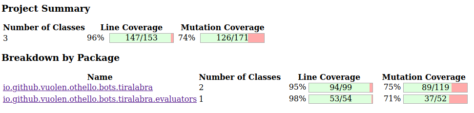

# Testing document

## General testing information

It is quite difficult and counter-intuitive to thoroughly test a game AI. Given the millions of possible paths the bot could take, it is almost impossible to determine which of these are optimal. Because of this, the test cases are limited to board states where it is clear which the objectively best path is. These board states are states near the end of the game, or completely fabricated ones with impossible disk placements.

Game logic is fairly easy to test though, so `GameLogicTests` are more comprehensive.

## Performance tests

The project has a couple of performance tests which can be run by running `io.github.vuolen.othello.tiralabra.Performance`.

## Running the tests and creating a test coverage report

Navigate to `othello-bot/` on your terminal, run `mvn test && mvn org.pitest:pitest-maven:mutationCoverage` and open `target/pit-reports/index.html` on your browser.

## Pitest coverage reports

